# Playground

:doge:

```sh
# c compile and run
rm ./playground; gcc -o playground playground.c; ./playground

# php run
php playground.php
```



```sh
# c compile and run
rm ./playground; gcc -o playground playground.c; ./playground

# php run
php playground.php
```


<hr style="page-break-after: always;"/>
1
